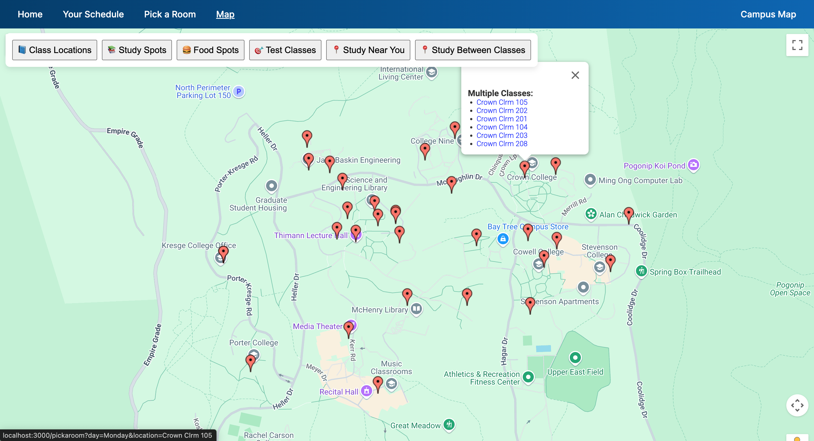

# BananaBreak: UCSC Classroom Finder

**BananaBreak** is a full-stack system built to help UCSC students find empty classrooms to relax, study, or hang out between classes.
---


## How to Run

### 1. Clone the repo & setup environment

```bash
git clone https://github.com/varunpalanisamy/BananaBreak.git
cd BananaBreak
python -m venv newenv
source newenv/bin/activate
pip install -r requirements.txt
npm install
```

---

### 2. Add Google Maps API Key

Create a file:

```
public/config.js
```

With the contents:

```js
"GOOGLE_MAPS_API_KEY": "YOUR_GOOGLE_MAPS_API_KEY"
```
Replace with your own API key. Make sure you enable:
- Maps JavaScript API
- Geocoding API
- Distance Matrix API

---

### 3. Run Website

```bash
node index.js
```

Visit `http://localhost:3000` in your browser.

---

## Dependencies

All dependencies are listed in `requirements.txt`:

- `selenium`
- `webdriver-manager`
- `pandas`
- `bs4`
- `pymongo`
- `streamlit`
- `urllib3`

Install all at once:

```bash
pip install -r requirements.txt
```

---

## Made by Varun Palanisamy and Shivani Belambe

*Project for UCSC – helping students find quiet classrooms and reduce stress during breaks between classes.*
